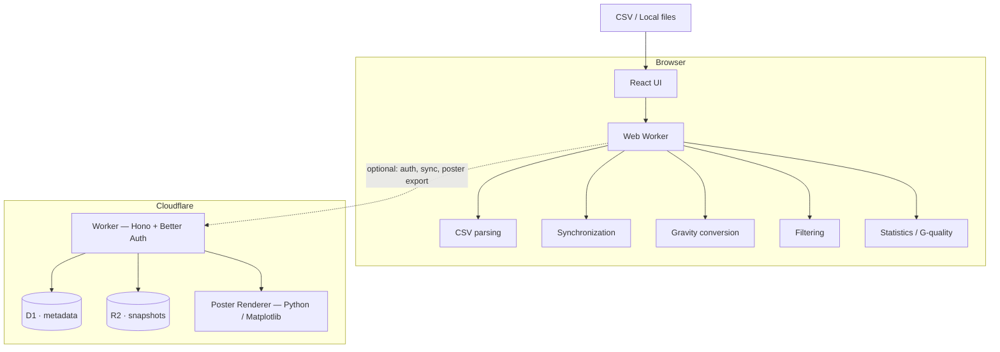

# AAT Web

[](https://github.com/sata04/AAT-Web/actions/workflows/ci.yml)
[](https://github.com/sata04/AAT-Web/actions/workflows/security.yml)
[](LICENSE)
[](https://renovatebot.com)
[](https://biomejs.dev)
[](tsconfig.base.json)
[](package.json)
[](https://codescene.io/projects/83525)

**AAT Web** is a browser-based acceleration analysis tool for microgravity drop-tower experiments.

Desktop版AAT（Python / PySide6）の解析ロジックをWeb向けに移植し、Inner Capsule / Drag Shield 2センサーのCSV読み込みから同期・重力換算・統計解析・可視化・Excelエクスポートまでをブラウザ上で実行できるようにしたWebアプリケーションです。

Governing principle は「**local analysis is the product; the cloud is an optional authenticated research workspace**」。ネットワークに接続していないログアウト状態のユーザーでも、CSVの読み込み・解析・グラフ表示・範囲選択・統計値の確認・データセット比較・Excelエクスポートまで、すべて行えることを前提に設計されています。詳細は [`docs/web-architecture.md`](docs/web-architecture.md) を参照してください。

## Features

- **ブラウザ上での加速度解析**
  - UTF-8 / Shift_JIS CSVの読み込み
  - Inner Capsule / Drag Shield センサーデータの同期
  - 加速度から重力加速度（G）への換算
  - データ範囲・重力レベルによるフィルタリング
  - 最小標準偏差区間の検出
  - G-qualityなどの統計量計算

- **可視化・出力**
  - インタラクティブなグラフ表示（モバイル画面にも対応）
  - 解析結果のExcelエクスポート
  - フォーマルポスター向けの高解像度画像生成

- **Desktop AATとの数値互換性**
  - Python版AATをリファレンス実装として使用（`reference/python/core`）
  - Golden testによるTypeScript実装との比較
  - NumPyのpairwise summationを再実装し、浮動小数点演算をビット単位で一致させている（[`docs/numerical-compatibility.md`](docs/numerical-compatibility.md)）

- **Local-first**
  - 通常の解析はブラウザ内で完結し、CSVをサーバーへ送信せずに利用可能
  - PWA対応（Service Worker）でオフライン利用が可能

- **Optional Cloud Workspace**
  - Passkeyを中心とした招待制の認証（Better Auth）
  - 解析履歴のクラウド保存（D1 / R2）
  - Cloudflare Container上のPython/Matplotlibによる、デスクトップ版と画素単位で一致する高品質グラフレンダリング

## Architecture



ブラウザ側の解析エンジン（`packages/analysis-core`）が数値計算の正本です。クラウド側は認証・データ保存・高品質な画像生成などを担当し、Poster Rendererはブラウザ側ですでに算出済みの数値データを描画するだけで、解析そのものは一切行いません。

詳しい設計については [`docs/web-architecture.md`](docs/web-architecture.md) を参照してください。

## Numerical Compatibility

AAT Webの解析ロジックは、Desktop版AATのPython実装を基準に検証しています。参照しているAATのコミットは [`reference/python/REFERENCE_COMMIT.txt`](reference/python/REFERENCE_COMMIT.txt) に記録されています。

Golden testでは、実際のPython実装とWeb側のTypeScript実装を同じ入力データで実行し、解析結果を比較しています。互換性の詳細や意図的な差異については [`docs/numerical-compatibility.md`](docs/numerical-compatibility.md) を参照してください。

## Development

### Requirements

- Node.js 22 以上（CIはNode.js 24で実行）
- pnpm（`corepack enable` で `package.json` の `packageManager` に固定されたバージョンが有効になります）
- Python 3.12以上（`reference/python` のGolden testや `poster-renderer` を扱う場合）

### Setup

```bash
git clone https://github.com/sata04/AAT-Web.git
cd AAT-Web

corepack enable
pnpm install
```

開発サーバーを起動します。

```bash
pnpm dev
```

### Checks

```bash
pnpm lint # biome
pnpm typecheck
pnpm test # scripts/*.test.mjs のあと全パッケージのテスト
pnpm build
pnpm check:bundle # wrangler dry run + Workerサイズゲート
```

Desktop AATとのGolden testを確認する場合：

```bash
pnpm golden:check
```

`poster-renderer` のテストを実行する場合：

```bash
./poster-renderer/.venv/bin/python -m pytest poster-renderer/tests -q
```

コミット前の identity チェックについては [`AGENTS.md`](AGENTS.md) を必ず参照してください。

## Repository Structure

```text
AAT-Web/
├── apps/
│   └── web/
│       ├── src/ # React application
│       └── worker/ # Cloudflare Worker: auth, authorization, D1, R2, quotas
├── packages/
│   ├── analysis-core/ # The numerical engine. No DOM, no React.
│   ├── plot-spec/ # The validated poster specification and frozen presets.
│   └── shared/ # Errors, config + hashing, run codes, snapshot format, capabilities.
├── poster-renderer/ # Pinned Python + Matplotlib container
├── reference/
│   └── python/
│       └── core/ # Vendored desktop AAT core. Read-only numerical oracle.
├── docs/ # Architecture, security, and process documentation
└── scripts/ # Development / CI utilities
```

## Security

AAT Webのクラウド機能ではBetter Authを利用し、Passkeyを中心とした招待制の認証を採用しています。本番用の認証情報・秘密鍵・データベース認証情報などはリポジトリには保存しません。

セキュリティ設計や認証方式については以下を参照してください。

- [`docs/auth-security.md`](docs/auth-security.md)
- [`docs/security-scanning.md`](docs/security-scanning.md)
- [`docs/supply-chain.md`](docs/supply-chain.md)

脆弱性や認証情報の漏洩を発見した場合は、公開Issueへ機密情報を書き込まないでください。

## Documentation

### Architecture & Compatibility

- [Web Architecture](docs/web-architecture.md)
- [Numerical Compatibility](docs/numerical-compatibility.md)
- [Migration from Desktop](docs/migration-from-desktop.md)
- [Poster Renderer](docs/poster-renderer.md)
- [Cloud Data Model](docs/cloud-data-model.md)

### Security

- [Authentication & Security](docs/auth-security.md)
- [Security Scanning](docs/security-scanning.md)
- [Supply Chain Security](docs/supply-chain.md)

### Process & Operations

- [CI](docs/ci.md)
- [Deployment](docs/deployment.md)
- [Versioning](docs/versioning.md)
- [Cost Controls](docs/cost-controls.md)
- [Commit Identity](docs/commit-identity.md)

## License

AAT Web is licensed under the [Apache License 2.0](LICENSE).

Third-party libraries remain subject to their respective licenses.
